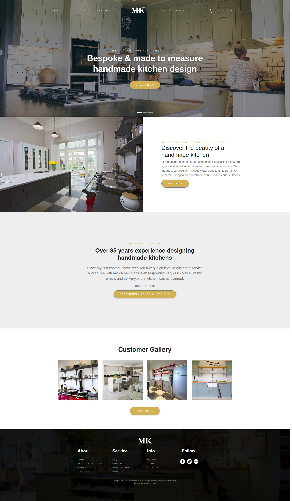

<h1 align="center">
  <br>
  Home Kitchen 
  <br>
</h1>

<p align="center">
  <a href="#">
    
  </a>
</p>

<p align="center">
  • <a href="#how-to-use">How To Use</a> •
  <a href="#built-with">Built With</a> •
  <a href="#description">Description</a> •
  <a href="#file-stucture">File Stucture</a> •
   <a href="#author">Author</a> •

</p>

## Description

> This Application build by using ReactJS Library. Layout was taken from MTC Home Kitchen.

**Final Result look like that and you can try a <a href="https://home-kitchen-beka.web.app/"> Live View</a> also.** 

## Built With

 <h2>React  <a href="https://opencollective.com/choo/sponsor/0/website" target="_blank">
 </a> </h2>
 <hr>

## Tools

- npm
- React
- Bootstrap
- Sass
- Visual Studio Code
- webpack
- Git
- Firebase (Deployment Server)

## How To Use

To clone and run this application, you'll need [Git](https://git-scm.com) and [npm](https://nodejs.org/en/) installed on your computer. From your command line:

```bash
# Clone this repository
$ git clone https://github.com/Bekhzod96/home-kitchen.git

# Go into the repository
$ cd home-kitchen

# To install all dependency
$ npm i

# To install all dependency
$ npm start

```

## File Stucture

```bash
# All the code is insight /src folder
Main Entry Point to the application is

$ cd ./src/index.js

#All React Component allocated in

$ cd ./src/components

#Layout of the Application is on

$ cd ./src/App.js

```

## Author

👤 **Bekhzod Akhrorov**

- Github:[@Bekhzod96](https://github.com/Bekhzod96)
- Twitter: [@Begzod](https://twitter.com/25d47e8987f740b)
- Linkedin:[@Bekhzod AKhrorov](https://www.linkedin.com/in/bekhzod-akhrorov/)
